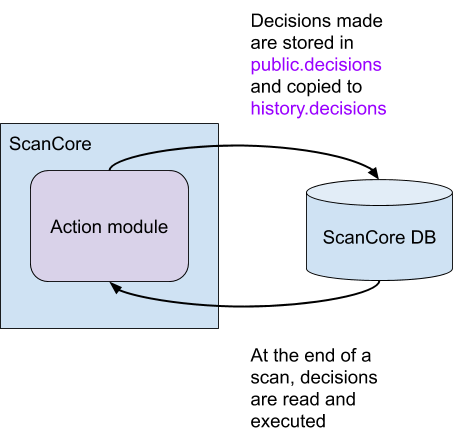
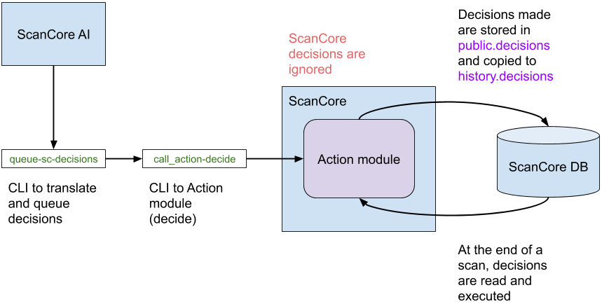

# [Anvil!](https://www.alteeve.com/w/Anvil!) m2 - [Striker](https://www.alteeve.com/w/Striker) + [ScanCore](https://www.alteeve.com/w/ScanCore) v2.0.1

Welcome to the v2.0.0 release of the _Anvil!_ m2 [Intelligent Availability](https://www.alteeve.com/w/Intelligent_Availability)™ platform!

What is an _Anvil!_ Platform?

- It is the first server platform designed with the singular focus of protecting your servers and keeping them running under even extreme fault conditions.
- It is fully self-contained, making it ideal for totally offline operation.
- It is a "self driving" server availability platform that can continuously monitors internal and external data sources, compiling, analyzing and autonomously deciding when and what action to take to protect your servers. It is ideally suited for extended remote deployments and "hands off" operation.
- It is based on an extensively field tested, open architecture with full data, mechanical and electrical redundancy allowing any component to be failed, removed and replaced without the need for a maintenance window. The _ANvil!_ platform has over five years of real-world deployment over dozens of sites and an historic uptime of over 99.9999%.
- It is extremely easy to use, minimizing the opportunity for human error and making it as simple as possible for "remote hands" to affect repairs and replacements without any prior availability experience and minimal technical knowledge.

In short, it is a server platform that just won't die.

- How do you build an _Anvil!_?

It's quite easy, but it does require a little more space than a README allows for.

- [How to Build an m2 Anvil!](https://www.alteeve.com/w/Build_an_m2_Anvil!)

The _Anvil!_ was designed and extensively tested on [Primergy](http://www.fujitsu.com/global/products/computing/servers/primergy/) servers, Brocade [ICX](http://www.brocade.com/en/products-services/switches/campus-network-switches.html) switches and APC [SmartUPS](http://www.apc.com/smartups/index.cfm?ISOCountryCode=ca) UPSes and [Switched PDU](http://www.apc.com/shop/ca/en/categories/power-distribution/rack-power-distribution/switched-rack-pdu/_/N-17k76am)s. That said, the _Anvil!_ platform is designed to be hardware agnostic and should work just fine on Dell, Cisco USC, NEC, Lenovo x-series, and other tier-1 server vendors.

[Alteeve](https://www.alteeve.com/), the company behind the _Anvil!_ project, actively supports the [open source](https://www.alteeve.com/w/Support) community. We also offer commercial support contracts to assist with any stage of deployment, operation and custom development.

# Action Module

The purpose of the Action module is to isolate the ScanCore decision logic.

## Overview



With the Action module, ScanCore's decision making process has been modified to:

1. ScanCore makes a decision through `decide()` in the Action module
2. `decide()` puts the decision into `public.decisions` inside ScanCore's database; the decisions table is essentially a queue
3. The inserted decision gets replicated to `history.decisions`
4. When ScanCore reaches the end of a scan, it executes all decisions in `public.decisions`
5. Executed decisions are removed from `public.decisions`

## Allowing External Decisions



Two additional pieces have been added along with the Action module to allow the AI to make decisions:

### 1. `call_action-decide` CLI tool

`call_action-decide` calls `decide()` in the Action module to insert external decisions. It takes 2 arguments in the form of switches:

1. (required) `--decision`, and
2. (optional) `--node-uuid`

Since this tool exists on all nodes and strikers, it is unnecessary to add additional arguments, i.e., host UUID, to determine the script's environment. Only decisions 10 and 11 (refer to the [striker decisions table](#striker-decisions)) require `--node-uuid` because it specifies which node to boot/reboot.

Example usage:

```
call_action-decide --decision "10" --node-uuid "f5ac6b0b-9ef2-4b52-abcb-8fd46135a65c"
```

### 2. `scancore::prevent_decision_making` flag in `/etc/striker/striker.conf`

The `prevent_decision_making` flag prevents ScanCore from queuing decisions. It can be set to:

- `0`: allow ScanCore to queue decisions, or
- `1`: prevent ScanCore from queuing decisions

## Decisions Definition

### Node Decisions

These decisions are only made by **nodes**.

| Number | Definition                                                                                                                                                |
| ------ | --------------------------------------------------------------------------------------------------------------------------------------------------------- |
| 1      | Enter (or reenter) stable **power** state and clear power Warnings.                                                                                       |
| 2      | Enter (or reenter) stable **temperature** state and clear temperature Warnings.                                                                           |
| 3      | Enter **power** Warning state and send notifications stating that power abnormalities were detected.                                                      |
| 4      | Enter **temperature** Warning state and send notifications stating that temperature abnormalities were detected.                                          |
| 5      | The node that made this decision will shutdown with **power** as reason.                                                                                  |
| 6      | The node that made this decision will shutdown with **temperature** as reason.                                                                            |
| 7      | Due to abnormalities in **power**, ScanCore will 1) determine whether servers need to be migrated, and 2) select one node to shutdown to shed load.       |
| 8      | Due to abnormalities in **temperature**, ScanCore will 1) determine whether servers need to be migrated, and 2) select one node to shutdown to shed load. |
| 9      | Migrate servers                                                                                                                                           |

### Striker Decisions

These decisions are only made by **strikers**.

| Number | Definition  |
| ------ | ----------- |
| 10     | Boot node   |
| 11     | Reboot node |

Note: these decisions were extracted and numbered regardless of whether they are actually used.
