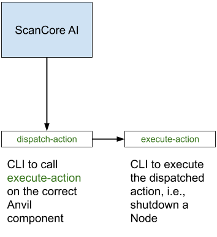

# [Anvil!](https://www.alteeve.com/w/Anvil!) m2 - [Striker](https://www.alteeve.com/w/Striker) + [ScanCore](https://www.alteeve.com/w/ScanCore) v2.0.1

Welcome to the v2.0.0 release of the _Anvil!_ m2 [Intelligent Availability](https://www.alteeve.com/w/Intelligent_Availability)™ platform!

What is an _Anvil!_ platform?

- It is the first server platform designed with the singular focus of protecting your servers and keeping them running under even extreme fault conditions.
- It is fully self-contained, making it ideal for totally offline operation.
- It is a "self driving" server availability platform that can continuously monitors internal and external data sources, compiling, analyzing and autonomously deciding when and what action to take to protect your servers. It is ideally suited for extended remote deployments and "hands off" operation.
- It is based on an extensively field tested, open architecture with full data, mechanical and electrical redundancy allowing any component to be failed, removed and replaced without the need for a maintenance window. The _Anvil!_ platform has over five years of real-world deployment over dozens of sites and an historic uptime of over 99.9999%.
- It is extremely easy to use, minimizing the opportunity for human error and making it as simple as possible for "remote hands" to affect repairs and replacements without any prior availability experience and minimal technical knowledge.

In short, it is a server platform that just won't die.

- How do you build an _Anvil!_?

It's quite easy, but it does require a little more space than a README allows for.

- [How to Build an m2 _Anvil!_](https://www.alteeve.com/w/Build_an_m2_Anvil!)

The _Anvil!_ platform was designed and extensively tested on [Primergy](http://www.fujitsu.com/global/products/computing/servers/primergy/) servers, Brocade [ICX](http://www.brocade.com/en/products-services/switches/campus-network-switches.html) switches and APC [SmartUPS](http://www.apc.com/smartups/index.cfm?ISOCountryCode=ca) UPSes and [Switched PDU](http://www.apc.com/shop/ca/en/categories/power-distribution/rack-power-distribution/switched-rack-pdu/_/N-17k76am)s. That said, the _Anvil!_ platform is designed to be hardware agnostic and should work just fine on Dell, Cisco USC, NEC, Lenovo x-series, and other tier-1 server vendors.

[Alteeve](https://www.alteeve.com/), the company behind the _Anvil!_ project, actively supports the [open source](https://www.alteeve.com/w/Support) community. We also offer commercial support contracts to assist with any stage of deployment, operation and custom development.

# Actions for the AI

This section provides an overview of the components involved in supporting the "ScanCore AI".

## Overview



Two pieces have been added in order for the AI to dispatch actions and prevent interference when the dispatched actions are executed:

### 1. `execute-action` CLI tool

`execute-action` accepts an action number and executes the corresponding action. It takes 2 arguments in the form of switches:

1. (required) `--action`, and
2. (optional) `--node-uuid`

Since this tool exists on all Nodes and Strikers, it is unnecessary to add additional arguments, i.e., host UUID, to determine the script's environment. Only decision 4 (refer to the [Striker decisions table](#striker-actions)) require `--node-uuid` because it specifies which node to boot.

Example usage:

```
execute-action --action "4" --node-uuid "f5ac6b0b-9ef2-4b52-abcb-8fd46135a65c"
```

### 2. `scancore::post_scan_checks::enabled` flag in `/etc/striker/striker.conf`

The `scancore::post_scan_checks::enabled` flag controls whether ScanCore should be analyzing the data collected by the scan agents and taking action based on the analysis. It can be set to:

- `0`: ignore post scan checks, or
- `1`: perform post scan checks

## Actions Definition

### Node Actions

These actions are only executed by **Nodes**.

| Number | Definition                                                                             |
| ------ | -------------------------------------------------------------------------------------- |
| 1      | Do nothing.                                                                            |
| 2      | Migrate Anvil servers to the Node on which the action was executed.                    |
| 3      | Shutdown a Node; it will be auto-removed from the cluster during the shutdown process. |

### Striker Actions

These actions are only executed by **Strikers**.

| Number | Definition                                                                        |
| ------ | --------------------------------------------------------------------------------- |
| 4      | Boot a Node; it will be auto-added to the cluster during the Node's boot process. |
